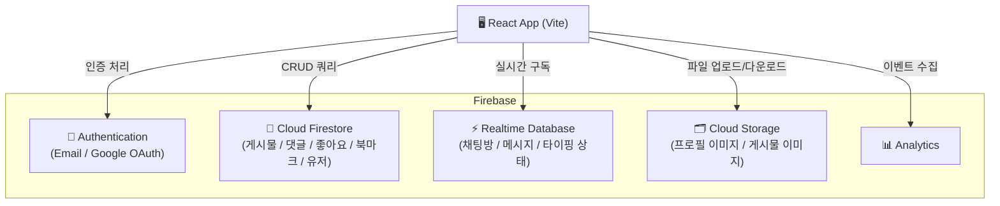

<div align="center">

# 🤖 AI Community

**Firebase 기반의 AI 전문 커뮤니티 플랫폼**

[](https://react.dev/)
[](https://www.typescriptlang.org/)
[](https://firebase.google.com/)
[](https://vitejs.dev/)
[](https://tailwindcss.com/)
[](LICENSE)

<br/>

> AI 도구, 프롬프트 엔지니어링, AI 뉴스를 함께 공유하는 실시간 커뮤니티  
> Google 로그인, 실시간 1:1 채팅, 다크모드를 지원하는 풀스택 웹앱

</div>

---

## ✨ 주요 기능 (Features)

### 🔐 인증 시스템
- **이메일/비밀번호** 회원가입 및 로그인
- **Google 소셜 로그인** (팝업 방식)
- **비밀번호 재설정** 이메일 발송
- **보호된 라우트** - 미인증 사용자 자동 리다이렉트

### 📝 게시물 관리
- **카테고리 분류** - AI 도구 / 프롬프트 엔지니어링 / AI 뉴스 / AI 연구 / 개발 / 자유 주제
- **정렬 옵션** - 최신순 / 인기순 (좋아요 기준)
- **이미지 업로드** - Firebase Storage를 통한 다중 이미지 첨부
- **YouTube 임베드** - 영상 URL 입력 시 자동 미리보기
- **태그 시스템** - 게시물에 자유 태그 추가
- **소프트 삭제** - 게시물 삭제 시 데이터 보존

### 💬 소셜 인터랙션
- **좋아요** - 낙관적 UI 업데이트 (즉각적 반응)
- **북마크** - 관심 게시물 저장 및 목록 관리
- **댓글** - 게시물별 댓글 작성/삭제, 댓글 좋아요

### 💬 실시간 1:1 채팅
- **Firebase Realtime Database** 기반의 실시간 메시지 전송
- **채팅 목록 팝업** - 헤더에서 빠른 대화방 접근
- **타이핑 표시기** - 상대방 입력 중 실시간 표시
- **읽지 않은 메시지 뱃지** - 채팅 알림 카운터
- **동시 3개 채팅창** 지원

### 👤 사용자 프로필
- **프로필 편집** - 닉네임, 소개, 아바타 이미지 변경
- **온보딩 설문** - AI 관심사 / 경험 수준 / 선호 주제 수집
- **내 게시물 / 좋아요 / 북마크** 목록 페이지

### 🎨 UI/UX
- **다크 / 라이트 / 시스템** 테마 토글 (localStorage 유지)
- **반응형 디자인** - 모바일, 태블릿, 데스크탑 지원
- **Backdrop Blur 헤더** - sticky 스크롤 시 배경 흐림 효과

---

## 🏗️ 기술 스택 (Tech Stack)

| 구분 | 기술 | 버전 |
|------|------|------|
| **프론트엔드** | React | 19 |
| | TypeScript | ~5.9 |
| | React Router DOM | 7 |
| | Lucide React (아이콘) | 0.562 |
| **스타일링** | TailwindCSS | 3 |
| | class-variance-authority | 0.7 |
| | clsx + tailwind-merge | - |
| **백엔드 (BaaS)** | Firebase Authentication | 12 |
| | Cloud Firestore | 12 |
| | Firebase Storage | 12 |
| | Firebase Realtime Database | 12 |
| | Firebase Analytics | 12 |
| **빌드 도구** | Vite | 7 |
| | ESLint | 9 |

---

## 🗄️ Firebase 서비스 아키텍처



---

## 📁 프로젝트 구조 (Project Structure)

```
community-app/
├── public/                     # 정적 파일
├── src/
│   ├── components/
│   │   ├── auth/
│   │   │   └── ProtectedRoute.tsx       # 인증 보호 래퍼
│   │   ├── chat/
│   │   │   ├── ChatListPopup.tsx        # 채팅 목록 드롭다운
│   │   │   ├── ChatManager.tsx          # 채팅 상태 관리
│   │   │   ├── ChatWindow.tsx           # 개별 채팅창 (플로팅)
│   │   │   └── MessageNotification.tsx  # 읽지 않은 메시지 뱃지
│   │   ├── comment/
│   │   │   └── CommentSection.tsx       # 댓글 목록 & 입력
│   │   ├── common/
│   │   │   ├── Loading.tsx              # 로딩 스피너
│   │   │   ├── ThemeToggle.tsx          # 다크/라이트 토글 버튼
│   │   │   └── UserNameButton.tsx       # 유저 이름 클릭 버튼
│   │   ├── layout/
│   │   │   ├── Header.tsx               # 상단 네비게이션
│   │   │   ├── Footer.tsx               # 하단 푸터
│   │   │   └── MainLayout.tsx           # 전체 레이아웃 래퍼
│   │   ├── post/
│   │   │   ├── ImageUpload.tsx          # 이미지 업로드 컴포넌트
│   │   │   └── YouTubeInput.tsx         # YouTube URL 입력 & 미리보기
│   │   └── ui/
│   │       ├── button.tsx               # 공통 버튼 (CVA 기반)
│   │       ├── card.tsx                 # 카드 컴포넌트
│   │       └── input.tsx                # 인풋 컴포넌트
│   ├── contexts/
│   │   ├── AuthContext.tsx              # 전역 인증 상태
│   │   ├── ChatContext.tsx              # 전역 채팅 상태
│   │   └── ThemeContext.tsx             # 전역 테마 상태
│   ├── pages/
│   │   ├── Home.tsx                     # 게시물 피드 (메인)
│   │   ├── Login.tsx                    # 로그인 페이지
│   │   ├── Signup.tsx                   # 회원가입 페이지
│   │   ├── Survey.tsx                   # 온보딩 설문 페이지
│   │   ├── Profile.tsx                  # 프로필 페이지
│   │   ├── NewPost.tsx                  # 게시물 작성 페이지
│   │   ├── PostDetail.tsx               # 게시물 상세 페이지
│   │   ├── EditPost.tsx                 # 게시물 수정 페이지
│   │   ├── Bookmarks.tsx                # 북마크 목록 페이지
│   │   ├── Likes.tsx                    # 좋아요 목록 페이지
│   │   └── NotFound.tsx                 # 404 페이지
│   ├── services/
│   │   ├── firebase.ts                  # Firebase 초기화 & 서비스 export
│   │   ├── auth.service.ts              # 인증 (가입/로그인/로그아웃)
│   │   ├── post.service.ts              # 게시물 CRUD
│   │   ├── comment.service.ts           # 댓글 CRUD
│   │   ├── like.service.ts              # 좋아요 토글
│   │   ├── bookmark.service.ts          # 북마크 토글
│   │   ├── chat.service.ts              # 실시간 채팅
│   │   ├── storage.service.ts           # 파일 업로드
│   │   └── user.service.ts              # 사용자 프로필 관리
│   ├── types/
│   │   ├── post.types.ts                # Post, Comment, Category 타입
│   │   ├── user.types.ts                # User, UserProfile, SurveyData 타입
│   │   ├── chat.types.ts                # Message, ChatRoom, ChatPreview 타입
│   │   └── interaction.types.ts         # Like, Bookmark 타입
│   ├── utils/
│   │   └── youtube.ts                   # YouTube URL 파싱 유틸
│   ├── App.tsx                          # 라우팅 설정
│   └── main.tsx                         # 앱 진입점
├── .env.example                         # 환경변수 샘플
├── firebase.json                        # Firebase 배포 설정
├── firestore.rules                      # Firestore 보안 규칙
├── firestore.indexes.json               # Firestore 인덱스
├── database.rules.json                  # Realtime Database 보안 규칙
├── tailwind.config.js                   # TailwindCSS 설정
├── vite.config.ts                       # Vite 빌드 설정
└── tsconfig.app.json                    # TypeScript 설정
```

---

## 🗺️ 라우팅 구조

| 경로 | 컴포넌트 | 인증 필요 | 설명 |
|------|----------|:---------:|------|
| `/` | `Home` | ✗ | 게시물 피드 (최신순/인기순) |
| `/login` | `Login` | ✗ | 이메일 / Google 로그인 |
| `/signup` | `Signup` | ✗ | 이메일 회원가입 |
| `/survey` | `Survey` | ✅ | AI 관심사 온보딩 설문 |
| `/profile` | `Profile` | ✅ | 내 프로필 편집 |
| `/posts/new` | `NewPost` | ✅ | 새 게시물 작성 |
| `/posts/:postId` | `PostDetail` | ✗ | 게시물 상세 보기 |
| `/posts/:postId/edit` | `EditPost` | ✅ | 게시물 수정 |
| `/bookmarks` | `Bookmarks` | ✅ | 북마크한 게시물 |
| `/likes` | `Likes` | ✅ | 좋아요한 게시물 |

---

## 🚀 빠른 시작 (Quick Start)

### 전제 조건 (Prerequisites)

- [Node.js](https://nodejs.org/) **18.0** 이상
- [npm](https://www.npmjs.com/) 또는 [pnpm](https://pnpm.io/)
- [Firebase 프로젝트](https://console.firebase.google.com/) (무료 Spark 플랜 가능)

### 1단계: 저장소 클론 & 패키지 설치

```bash
# 저장소 클론
git clone <your-repo-url>
cd community-app

# 패키지 설치
npm install
```

### 2단계: Firebase 프로젝트 설정

1. [Firebase Console](https://console.firebase.google.com/)에 접속합니다.
2. **새 프로젝트 만들기**를 클릭하고 프로젝트 이름을 입력합니다.
3. **프로젝트 설정 > 일반 탭 > 내 앱** 섹션에서 웹 앱(`</>`)을 추가합니다.
4. 아래 Firebase 서비스를 활성화합니다.

```
Firebase Console에서 활성화할 서비스:
✅ Authentication → 로그인 방법 → 이메일/비밀번호 사용 설정
✅ Authentication → 로그인 방법 → Google 사용 설정
✅ Firestore Database → 데이터베이스 만들기 (프로덕션 모드로 시작)
✅ Storage → 시작하기
✅ Realtime Database → 데이터베이스 만들기
```

### 3단계: 환경변수 설정

```bash
# .env.example을 복사하여 .env 파일 생성
cp .env.example .env
```

`.env` 파일을 열고 Firebase 콘솔에서 복사한 값을 입력합니다:

```bash
# .env
VITE_FIREBASE_API_KEY=AIzaSy...
VITE_FIREBASE_AUTH_DOMAIN=your-project-id.firebaseapp.com
VITE_FIREBASE_DATABASE_URL=https://your-project-id-default-rtdb.firebaseio.com
VITE_FIREBASE_PROJECT_ID=your-project-id
VITE_FIREBASE_STORAGE_BUCKET=your-project-id.appspot.com
VITE_FIREBASE_MESSAGING_SENDER_ID=123456789012
VITE_FIREBASE_APP_ID=1:123456789012:web:abc123def456
VITE_FIREBASE_MEASUREMENT_ID=G-XXXXXXXXXX
```

> **값 확인 방법**: Firebase Console → 프로젝트 설정(⚙️) → 일반 탭 → `firebaseConfig` 객체

### 4단계: 보안 규칙 배포 (선택 사항)

Firebase CLI를 사용하면 보안 규칙을 코드로 관리할 수 있습니다.

```bash
# Firebase CLI 설치
npm install -g firebase-tools

# Firebase 로그인
firebase login

# 프로젝트 연결
firebase use --add

# 보안 규칙 & 인덱스 배포
firebase deploy --only firestore:rules,firestore:indexes,database,storage
```

> Firebase Console에서 직접 붙여넣기 하는 방법도 가능합니다. 아래 [보안 규칙](#-보안-규칙-security-rules) 섹션 참고.

### 5단계: 개발 서버 실행

```bash
npm run dev
```

브라우저에서 [http://localhost:5173](http://localhost:5173)을 엽니다. 🎉

---

## 🔧 환경변수 (Environment Variables)

| 변수명 | 필수 | 설명 |
|--------|:----:|------|
| `VITE_FIREBASE_API_KEY` | ✅ | Firebase 웹 API 키 |
| `VITE_FIREBASE_AUTH_DOMAIN` | ✅ | Auth 도메인 (OAuth 리다이렉트에 사용) |
| `VITE_FIREBASE_DATABASE_URL` | ✅ | Realtime Database URL (채팅 기능에 필수) |
| `VITE_FIREBASE_PROJECT_ID` | ✅ | Firebase 프로젝트 ID |
| `VITE_FIREBASE_STORAGE_BUCKET` | ✅ | Cloud Storage 버킷 주소 |
| `VITE_FIREBASE_MESSAGING_SENDER_ID` | ✅ | FCM 발신자 ID |
| `VITE_FIREBASE_APP_ID` | ✅ | 웹 앱 ID |
| `VITE_FIREBASE_MEASUREMENT_ID` | ✗ | Analytics 측정 ID (선택) |

> ⚠️ `.env` 파일은 절대로 Git에 커밋하지 마세요. `.gitignore`에 이미 포함되어 있습니다.

---

## 🛡️ 보안 규칙 (Security Rules)

### Firestore 규칙 요약

| 컬렉션 | 읽기 | 생성 | 수정 | 삭제 |
|--------|------|------|------|------|
| `users` | 전체 공개 | 본인만 | 본인만 | 불가 |
| `posts` | 공개된 게시물 | 로그인 + 본인 ID | 작성자만 | 작성자만 |
| `posts/{id}/comments` | 전체 공개 | 로그인 사용자 | 작성자만 | 작성자만 |
| `postLikes` | 전체 공개 | 로그인 + 본인 ID | - | 본인만 |
| `bookmarks` | 로그인 사용자 | 로그인 + 본인 ID | - | 본인만 |

Firebase Console에서 규칙을 직접 적용하려면:

```javascript
// firestore.rules 내용을 복사하여
// Firebase Console > Firestore > 규칙 탭에 붙여넣기
rules_version = '2';
service cloud.firestore {
  match /databases/{database}/documents {
    // ... (firestore.rules 파일 참고)
  }
}
```

---

## 📦 주요 npm 스크립트

```bash
# 개발 서버 시작 (HMR 포함)
npm run dev

# 프로덕션 빌드 (TypeScript 검사 포함)
npm run build

# 빌드 결과물 로컬 미리보기
npm run preview

# ESLint 코드 검사
npm run lint
```

---

## 🔄 데이터 모델 (Data Schema)

### Post (Firestore: `posts/`)

```typescript
interface Post {
  id: string
  title: string
  content: string
  authorId: string
  authorName: string
  authorPhotoURL: string | null
  createdAt: Timestamp
  updatedAt: Timestamp
  likeCount: number       // 좋아요 수
  commentCount: number    // 댓글 수
  bookmarkCount: number   // 북마크 수
  viewCount: number       // 조회 수
  tags?: string[]
  category?: string       // 'AI 도구' | '프롬프트 엔지니어링' | ...
  images?: string[]       // Storage URL 배열
  youtubeUrl?: string
  isPublished: boolean
  isDeleted: boolean      // 소프트 삭제
}
```

### Message (Realtime DB: `messages/{chatRoomId}/`)

```typescript
interface Message {
  id: string
  chatRoomId: string
  senderId: string
  senderName: string
  senderPhotoURL?: string | null
  text: string
  timestamp: number       // Unix milliseconds
  read: boolean
  readAt?: number
}
```

### UserProfile (Firestore: `users/`)

```typescript
interface UserProfile {
  uid: string
  email: string
  displayName: string
  photoURL: string | null
  bio: string
  interests: string[]             // 관심 AI 도구
  experienceLevel: 'beginner' | 'intermediate' | 'advanced' | 'expert'
  preferredTopics: string[]       // 선호 주제
  provider: 'email' | 'google'
  isProfileComplete: boolean      // 설문 완료 여부
  postCount: number
  likeCount: number
}
```

---

## 📸 스크린샷 (Screenshots)

> 스크린샷은 `screenshots/` 폴더에 추가 예정입니다.

| 홈 피드 (라이트) | 홈 피드 (다크) |
|:---:|:---:|
| - | - |

| 게시물 상세 | 실시간 채팅 |
|:---:|:---:|
| - | - |

---

## 🚢 배포 (Deployment)

### Firebase Hosting으로 배포

```bash
# 1. 프로덕션 빌드
npm run build

# 2. Firebase CLI 로그인 (최초 1회)
firebase login

# 3. 전체 배포 (Hosting + 규칙)
firebase deploy

# 4. Hosting만 배포
firebase deploy --only hosting
```

### Vercel / Netlify 배포

1. GitHub 저장소에 코드를 Push합니다.
2. Vercel 또는 Netlify에서 저장소를 연결합니다.
3. **빌드 명령어**: `npm run build`
4. **출력 디렉토리**: `dist`
5. **환경변수**: `.env`의 모든 `VITE_FIREBASE_*` 변수를 설정합니다.

---

## 🤝 기여 방법 (Contributing)

```bash
# 1. 저장소 Fork 후 클론
git clone https://github.com/your-username/community-app.git

# 2. 기능 브랜치 생성
git checkout -b feature/새기능명

# 3. 변경사항 커밋
git commit -m "feat: 새 기능 추가"

# 4. 브랜치 Push
git push origin feature/새기능명

# 5. Pull Request 생성
```

### 커밋 메시지 컨벤션

| 접두사 | 설명 |
|--------|------|
| `feat:` | 새로운 기능 추가 |
| `fix:` | 버그 수정 |
| `style:` | UI/스타일 변경 |
| `refactor:` | 코드 리팩토링 |
| `docs:` | 문서 수정 |
| `chore:` | 빌드 / 패키지 설정 변경 |

---

## 📄 라이선스 (License)

이 프로젝트는 [MIT License](LICENSE) 하에 배포됩니다.

---

<div align="center">

**[⬆ 맨 위로](#-ai-community)**

Made with ❤️ using React + Firebase

</div>
